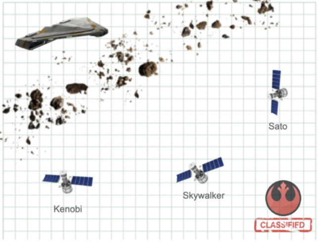

# Quasar Fire Operation

#### This is the proposed solution for the Quasar Fire Operation API Challenge from Mercado Libre.

## App Remote Location
The API is hosted on Heroku, so the first time you perform a request to that endpoint, 
you will have to wait until the app wakes up (since it is stored in a free Heroku account)
* [Heroku App Base Endpoint](https://bcardenas-quasar-api.herokuapp.com)
* [Heroku App Documentation](https://bcardenas-quasar-api.herokuapp.com/swagger-ui.html)
## Local Installation

### Method 1
* Install [docker](https://docs.docker.com/get-docker) on your OS.
* Check docker installation:
~~~
docker --version
~~~
* Build project image:
~~~
docker build -t quasar-image .
~~~
* Run project container:
~~~
docker run -d -p 8080:8080 --name quasar-api quasar-image
~~~
* Go to the [Swagger doc](http://localhost:8080/swagger-ui.html) to check that the application is running.

* If you want to use a different port number, then use the following command to run the project container (example using the port 5000):
~~~
docker run -d -p 5000:5000 -e PORT=5000 --name quasar-api quasar-image
~~~

### Method 2
* After installing docker, download the following image from docker hub:
~~~
docker pull bcardenase/quasar-api:v1.0
~~~
* Now run a docker container using that image:
~~~
docker run -d -p 8080:8080 --name quasar-api bcardenase/quasar-api:v1.0
~~~
## How to use this API
You can either use the Swagger Doc ([local](http://localhost:8080/swagger-ui.html) or [remote](https://bcardenas-quasar-api.herokuapp.com/swagger-ui.html)) 
or download the following [POSTMAN collection](src/main/resources/QuasarFireOperation.postman_collection.json) and importing it into your POSTMAN app.

**Note:** The POST request to the **/topsecret_split/{satellite_name}** endpoint, stores the satellites' info within a Cookie named **satellites** (encoded in Base64).
That cookie is updated every time you posted satellites' info (adding the new satellite info and/or updating the existing info of a satellite). 
Once the information of the 3 satellites is already stored, you can use the GET request to the **/topsecret_split** endpoint, to get the Spaceship position and message.

Since this info is stored within a cookie, you won't be able to modify that cookie value in Swagger (even when is accessible).

There is an additional endpoint (not requested in the challenge description) used to delete the satellites cookie.
You just have to perform a DELETE request to the **/topsecret_split/satellites** endpoint.